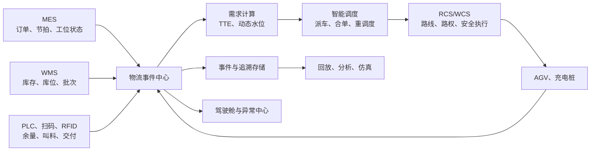

# Pack 产线 AGV 智能调度试点 PRD

## 1. 文档信息

| 项目 | 内容 |
| --- | --- |
| 产品名称 | Pack 产线 AGV 智能调度与物流追溯系统 |
| 文档版本 | V1.0 评审稿 |
| 试点范围 | 单条 Pack 产线线边配送与空箱、空托盘、周转载具回收 |
| 建设方式 | 从零规划，小范围闭环试点后逐步扩展 |
| 业务目标 | 降本增效、保供保产、质量追溯 |
| 核心能力 | 事件驱动的可解释智能调度 |

## 2. 背景与问题

Pack 产线物流同时受到生产节拍、物料齐套、线边容量、批次管理、道路资源和 AGV 运力约束。采用固定路线、固定周期或人工叫料时，通常存在以下问题：

1. 叫料依据依赖人工经验，无法准确判断工位物料耗尽时间，容易同时出现缺料和线边积压。
2. 调度只考虑任务先来后到或车辆距离，无法优先保障高停线风险任务。
3. 配送、空箱回收和充电相互割裂，车辆空驶、等待和集中充电占用有效运力。
4. 道路封锁、车辆故障、工位停机后依赖人工协调，异常恢复慢且过程不可回放。
5. 物料、批次、载具、车辆、工位和 Pack 生产订单之间缺少完整关联，质量问题难以快速追溯。

本项目通过统一需求计算、任务编排、AGV 调度、交通管制和事件追溯，验证一套可复制到其他 Pack 线及 Module 线的物流数智化方法。

## 3. 产品目标

### 3.1 业务目标

1. 保供保产：用预计物料耗尽时间驱动配送，优先消除物流原因造成的停线风险。
2. 降本增效：提高任务准时率和车辆有效载货率，减少空驶、等待、无效搬运及线边库存。
3. 质量追溯：实现物料、批次、载具、AGV、工位、操作事件和 Pack 生产订单的全链路追溯。
4. 异常韧性：在车辆故障、道路阻塞、缺料和工位停机时快速重调度，并保留人工干预能力。
5. 可复制性：通过配置物料、工位、车辆、路线和规则，使试点能力可以向更多产线扩展。

### 3.2 产品原则

- 安全和质量约束高于效率优化。
- 停线风险优先于最短路径和车辆局部效率。
- 第一阶段使用可解释的规则与约束优化，不依赖不可审计的黑盒决策。
- 调度系统给出决策，RCS 负责安全执行；业务系统与设备控制边界清晰。
- 自动决策必须可查看原因、可人工接管、可审计和可回放。

### 3.3 非目标

试点阶段不包含以下能力：

- 多车间、跨楼层或跨厂区的统一调度。
- AGV 车体控制器、导航算法和功能安全系统的研发。
- 通过视觉 AI 直接判断所有线边物料数量。
- 强化学习等黑盒算法直接控制生产车辆。
- 全量 Module/Pack 物料和所有供应商设备的一次性接入。
- 替代 MES、WMS、QMS、Andon 或设备管理系统的既有职责。

## 4. 试点边界与假设

### 4.1 物理范围

试点覆盖一条 Pack 线，包含一个线边超市、生产工位接驳点、空载具回收点、充电区和连接这些点位的 AGV 通行网络。

默认以 3 至 5 类高频或高停线影响物料、2 至 4 台同构或兼容 AGV 开展试点。物料类别、车辆数量和工位数量均为配置参数，数量调整不改变本 PRD 的业务边界。

### 4.2 业务范围

试点闭环包括：

```text
生产需求同步 -> 物料耗尽预测 -> 配送任务生成 -> 库存与批次校验
-> AGV 任务分配 -> 路径与路权执行 -> 工位交付防错
-> 空载具回收 -> 库存及任务回写 -> 追溯与运营分析
```

### 4.3 接入假设

- MES 可提供生产订单、计划节拍、实际产出、工位运行状态和产品标识。
- WMS 可提供物料、库存、库位、批次、冻结状态和出入库结果。
- RCS 可提供车辆、任务、位置、电量、路线和异常状态，并接受任务下发、取消和优先级调整。
- 工位接驳点可通过 PLC、按钮、扫码、RFID 或电子看板中的至少一种方式提供需求与交付确认。
- 所有外部系统均通过适配器接入；接口协议差异不进入调度领域模型。

## 5. 用户与职责

| 角色 | 核心诉求 | 系统权限 |
| --- | --- | --- |
| 物流调度员 | 及时发现缺料、堵路和车辆异常，必要时人工干预 | 查看全局、置顶、转派、撤销任务，封锁或恢复路段 |
| 线边物流员 | 正确完成取料、交付和空载具回收 | 扫描确认、上报物料或载具异常 |
| 生产班组长 | 确保工位不断料，了解配送 ETA | 查看工位风险、任务进度，发起紧急叫料 |
| 质量人员 | 追溯物料批次及交付过程，调查错料风险 | 查询追溯链、导出事件、处理质量拦截 |
| 设备与运维人员 | 定位 AGV、RCS、网络和充电异常 | 查看设备事件、解除维护状态 |
| 物流规划人员 | 优化车辆数量、路线、站点和调度参数 | 查看 KPI、任务回放、仿真并提交参数变更 |
| 系统管理员 | 维护基础数据、接口和权限 | 配置主数据、规则、账号及审计策略 |

## 6. 核心业务指标

指标以试点上线前连续两周的同班次数据作为基线；无自动化历史数据时，通过人工配送记录和现场测时建立基线。

| 指标 | 试点目标 | 计算口径 |
| --- | ---: | --- |
| 物流原因缺料停线 | 验收观察期为 0 | 因叫料、派车、运输或交付延误导致的停线次数 |
| 配送任务准时率 | >= 98% | 承诺到达时间内完成交付的任务数 / 已完成配送任务数 |
| 关键物料追溯完整率 | 100% | 六类关联信息完整的交付数 / 关键物料交付总数 |
| 错料、错站、错批放行 | 0 | 防错拦截后仍完成交付的异常次数 |
| AGV 空驶距离 | 较基线降低 >= 20% | 无有效载荷行驶距离 / 总行驶距离 |
| 单位产出物流里程 | 较基线降低 >= 15% | AGV 总里程 / 合格 Pack 产出数 |
| 异常任务自动转派时间 | <= 30 秒 | 车辆不可用至替代任务成功下发的时间 |
| 调度决策响应时间 | P95 <= 2 秒 | 需求或状态事件到调度结果生成的时间 |
| 状态数据新鲜度 | P95 <= 5 秒 | 当前时间与车辆、任务、工位最新状态时间之差 |

这些目标用于试点评价，不构成脱离现场节拍、道路和设备能力的单方面产能承诺。若现场安全规则限制并发能力，安全约束优先且需在验收记录中说明影响。

## 7. 业务流程

### 7.1 正常配送与回收

1. MES 同步生产计划、实际节拍和工位状态。
2. 系统根据线边有效库存、在途数量、消耗速率和安全余量计算物料预计耗尽时间。
3. 达到动态叫料条件时生成配送需求，并向 WMS 请求库存、库位和批次校验。
4. WMS 锁定符合 FIFO、质量和订单要求的库存，生成可执行取料任务。
5. 调度引擎过滤不满足车型、承重、电量、道路及接驳约束的车辆，对可行方案评分并派车。
6. RCS 控制 AGV 到达取料点；扫码或 RFID 核验物料、批次和载具。
7. AGV 运输至目标工位，系统再次核验工位、物料、批次和生产订单。
8. 交付确认后回写库存与任务状态，并自动匹配附近空载具回收任务。
9. AGV 将空载具送至指定回收点，任务关闭并写入完整事件链。

### 7.2 紧急叫料

1. 班组长从工位终端发起紧急叫料，并选择标准原因码。
2. 系统校验是否已存在相同物料、工位和订单的活动任务，避免重复派车。
3. 确认紧急需求后提高任务优先级，但不得绕过安全、质量、车型和批次硬约束。
4. 紧急任务影响其他任务 ETA 时，系统向相关工位发出延误预警。

### 7.3 异常重调度

1. 车辆、道路、物料或工位异常作为事件进入调度引擎。
2. 系统识别受影响的活动任务，区分可继续、需等待、需转派和必须人工处理四种结果。
3. 可自动处理的任务撤销原分配、释放相应资源，并选择替代车辆或路径。
4. 无可行解时，驾驶舱显示冲突约束、受影响工位、物料耗尽时间和建议处置动作。
5. 异常恢复后系统重新评估任务，不自动恢复已被人工锁定或质量冻结的任务。

## 8. 功能需求

### FR-01 生产需求与物料耗尽预测（P0）

系统应为每个纳入试点的工位物料持续计算：

- 线边实物数量、已锁定数量、在途数量和不可用数量。
- 当前实际消耗速率及最近 15 分钟的节拍波动。
- 预计耗尽时间 `TTE`。
- 从需求生成到完成交付的预计补给时间 `LTR`。
- 以安全裕量修正后的缺料风险等级。

推荐计算模型：

```text
有效可用量 = 线边合格库存 + 已确认在途量 - 已锁定生产需求
TTE = 有效可用量 / 当前有效消耗速率
触发叫料条件 = TTE <= 预计补给时间 + 安全裕量
```

当工位停机、生产订单切换或数据过期时，系统不得沿用失真的消耗预测，必须切换到预设保守水位并提示预测降级。

### FR-02 需求去重与任务生命周期（P0）

系统应使用工位、物料、生产订单和需求窗口作为幂等键，阻止按钮、PLC 或接口重试产生重复任务。

配送任务状态统一为：

```text
待校验 -> 待调度 -> 已分配 -> 取料中 -> 运输中 -> 待交付
-> 已交付 -> 回收中 -> 已完成
```

任务可以进入已暂停、已取消、异常待处理或质量冻结状态。所有状态变化必须记录事件时间、触发源、原因码、操作者或系统策略版本。

### FR-03 智能任务分配（P0）

调度引擎必须先应用硬约束，再对可行方案进行评分。

硬约束至少包括：

- AGV 类型、载具接口、承重和尺寸兼容。
- 物料批次、FIFO、质量冻结和生产订单匹配。
- 工位接驳能力、同时占用上限和允许到达时窗。
- 道路方向、容量、封锁状态和安全区域权限。
- AGV 剩余电量能够完成任务并抵达充电点。
- 车辆、取料点、交付点和回收点均处于可服务状态。

默认动态评分顺序为：

```text
停线风险 > 安全与道路冲突 > 物料及批次正确
> 配送准时 > 配送回收合单收益 > 空驶距离 > 充电效率
```

每次自动派单必须保存候选车辆、被过滤原因、最终得分构成和策略版本，以支持解释与回放。

### FR-04 配送与空载具合单（P0）

系统应在不影响关键配送 ETA 的前提下，把交付后的返程与同区域空箱、空托盘或周转载具回收任务合并。合单必须校验载具类型、车辆能力、回收点容量和额外绕行时间。

当配送任务进入高停线风险状态时，不得为了提高载货率增加非必要停靠点。

### FR-05 交付防错（P0）

取料与交付环节必须校验以下关联：

- 物料编码与数量。
- 批次与质量状态。
- 载具唯一标识。
- 目标工位与接驳点。
- 当前生产订单或 Pack 产品标识。
- 执行车辆与任务标识。

校验失败时系统禁止业务放行，提示明确差异并创建质量或物流异常。只有具备授权的人员可以执行例外放行，且必须填写原因并形成审计记录。

### FR-06 路权与拥堵控制（P0）

RCS 负责车辆级安全控制；调度系统负责向 RCS 提供业务优先级和路段可用状态。

系统应支持：

- 单行道、窄道、交叉口、工位接驳区和充电区容量配置。
- 道路临时封锁、定时封锁和恢复。
- 高优先级任务的业务路权建议，但不得覆盖 RCS 安全判定。
- 连续等待、循环避让和路段排队超限检测。
- 拥堵发生后的任务顺序调整或替代路径重算。

### FR-07 异常检测与动态重调度（P0）

系统应处理车辆离线、车辆故障、低电量、道路堵塞、取料失败、物料短缺、工位停机、接驳占用、扫码不一致和接口中断等异常。

车辆不可用时，系统应释放未进入不可逆物理动作的资源，并在 30 秒内完成任务转派或给出无可行解原因。已装载物料的车辆不得简单撤单，必须根据车辆位置和安全状态生成救援、人工卸载或继续执行建议。

### FR-08 充电调度（P1）

系统应基于当前电量、预计任务需求、充电桩状态和返回充电点所需电量安排充电。充电任务分为强制充电和机会充电：

- 达到安全电量下限时触发强制充电，车辆不再接受普通配送任务。
- 在任务低谷、车辆空闲且未来运力充足时触发机会充电。
- 充电计划不得导致预测窗口内关键任务无可用车辆。

### FR-09 ETA 与延误预警（P1）

系统应计算取料 ETA、交付 ETA 和任务完成 ETA。初期使用路段标准时间、当前排队、停靠服务时间和车辆状态计算；积累数据后可替换为预测模型。

预计无法在承诺时间完成时，系统应在实际超时前预警，展示影响工位、物料 TTE、当前任务阶段和建议处置。

### FR-10 全链路追溯（P0）

系统必须支持按以下任一标识进行正向或反向查询：

- Pack 产品或生产订单。
- 物料编码及批次。
- 载具标识。
- AGV 标识。
- 工位或接驳点。
- 调度任务及异常事件。

查询结果应展示需求来源、库存锁定、取料、运输、交付、防错校验、回收及人工干预的完整时间线，并支持按权限导出。

### FR-11 调度驾驶舱（P0）

驾驶舱以异常处置和业务决策为主，不以装饰性三维效果为目标。必须包含：

1. 产线物流总览：任务准时率、缺料风险、AGV 在线率、空驶率、活动异常。
2. 二维实时地图：车辆、路线、路段状态、工位、超市、回收点和充电区。
3. 任务队列：任务阶段、优先级、物料、工位、TTE、ETA、车辆和延误风险。
4. 异常中心：异常等级、影响范围、已持续时间、建议动作和处理状态。
5. 车辆检查器：位置、电量、任务、载荷、通信时间和最近事件。
6. 工位检查器：当前订单、节拍、物料余量、TTE、在途任务和交付记录。
7. 追溯查询与任务回放入口。

状态颜色仅用于运行、提醒、严重和离线等业务语义。地图更新时间、数据来源和数据质量必须可见。

### FR-12 人工干预与审计（P0）

授权用户可以置顶、转派、暂停、取消任务，封锁或恢复道路，并把车辆置为维护状态。人工操作不得绕过安全控制；涉及批次、质量冻结和例外放行时需要更高权限。

每次操作必须记录操作者、时间、原因码、备注、操作前状态和操作后状态。系统应支持查询人工干预对任务 ETA 和其他工位风险的影响。

### FR-13 参数与策略管理（P1）

系统应配置并版本化管理：

- 物料安全水位、安全裕量和关键等级。
- 工位、接驳点、服务时间和容量。
- 车辆能力、电量阈值和充电策略。
- 路网方向、容量、标准时间和封锁规则。
- 调度权重、合单绕行上限和异常超时阈值。

策略发布需保留版本、审批人和生效时间，并支持回退到上一有效版本。参数变化后的任务决策必须能关联到对应策略版本。

### FR-14 任务回放与运营分析（P1）

系统应按任务或时间窗口回放需求、库存、派车、车辆轨迹、道路状态、交付和异常事件。运营分析至少包括：

- 准时率及超时原因分布。
- 空驶、载货、等待、充电和故障时间占比。
- 物料缺料风险与线边库存趋势。
- 路段流量、排队、拥堵及工位等待热力图。
- 人工紧急叫料和人工调度发生频次。
- 配送回收合单率与节省里程。

## 9. 数据模型

### 9.1 核心实体

| 实体 | 关键字段 |
| --- | --- |
| Material | 物料编码、名称、关键等级、包装规格、质量状态 |
| MaterialLot | 批次、供应来源、生产时间、有效期、冻结状态 |
| LoadCarrier | 载具 ID、类型、容积、当前载荷、清洁或质量状态 |
| Station | 工位 ID、接驳点、当前订单、运行状态、容量 |
| LineSideStock | 工位、物料、合格数量、锁定数量、更新时间、数据质量 |
| LogisticsDemand | 需求 ID、来源、物料、数量、工位、TTE、最晚到达时间 |
| TransportTask | 任务 ID、取送点、状态、优先级、承诺时间、执行车辆 |
| Agv | 车辆 ID、能力、电量、位置、载荷、状态、最后通信时间 |
| RouteSegment | 路段 ID、方向、容量、占用、封锁状态、标准时间 |
| DispatchDecision | 决策 ID、候选集、过滤原因、评分明细、策略版本 |
| LogisticsEvent | 事件 ID、资产、任务、类型、时间、来源、前后状态 |
| TraceLink | 订单、Pack、物料批次、载具、车辆、工位、任务关联 |

### 9.2 事件要求

所有事件必须包含全局唯一事件 ID、事件发生时间、系统接收时间、来源系统、实体版本和关联业务标识。消费者按事件 ID 幂等处理；迟到事件按实体版本合并，不得把旧状态覆盖新状态。

关键状态事件应在本地短时断网时缓存，并在网络恢复后按原始发生时间补传。追溯页面同时显示发生时间和接收时间，以识别数据延迟。

## 10. 系统及数据流边界



职责约束：

- MES 是生产订单和工位生产状态的权威来源。
- WMS 是库存、库位、批次和质量冻结状态的权威来源。
- 调度引擎是业务任务优先级与车辆任务分配的权威来源。
- RCS 是车辆位置、路线执行、交通管制和设备安全状态的权威来源。
- 追溯库保存跨系统事件，不反向伪造各源系统的业务状态。

## 11. 接口需求

### 11.1 MES 接口

- 输入：生产订单、产品标识、计划节拍、实际产出、工位状态、换型事件。
- 输出：配送任务状态、预计到达时间、缺料风险和物流异常。
- 关键要求：订单和换型事件不得丢失；断连时系统进入预测降级并提示数据过期。

### 11.2 WMS 接口

- 输入：库存、库位、批次、冻结状态、锁定及出库结果。
- 输出：物料需求、库存锁定请求、取料完成、退回及异常结果。
- 关键要求：库存锁定与任务创建必须具备幂等标识，避免重复扣减。

### 11.3 RCS 接口

- 输入：车辆状态、位置、电量、载荷、任务进度、道路状态、充电桩状态和异常。
- 输出：任务创建、取消、暂停、优先级建议、取送点和道路封锁信息。
- 关键要求：明确任务接收、执行、失败和取消确认；系统不得仅凭下发成功认定车辆已经执行。

### 11.4 边缘及识别设备接口

- 输入：按钮或 PLC 叫料、线边余量、扫码/RFID 结果、接驳占用和交付确认。
- 输出：任务反馈、校验结果、声光或终端提示。
- 关键要求：识别失败必须有人工复核流程，不得自动生成虚假成功事件。

## 12. 异常与降级策略

| 场景 | 自动动作 | 人工动作 | 恢复条件 |
| --- | --- | --- | --- |
| AGV 离线或故障 | 锁车、释放可释放资源、重分配未装载任务 | 处理已装载车辆或现场救援 | 运维解除维护状态且 RCS 状态正常 |
| 道路堵塞或封锁 | 停止向路段分配新任务，重算路径与 ETA | 排除障碍或调整封路范围 | RCS 与现场确认路段可用 |
| WMS 无可用库存 | 暂停任务并提高缺料风险 | 盘点、补料或批准替代批次 | WMS 返回有效可锁定库存 |
| 工位停机 | 暂停非必要补给，保留已装载任务处置建议 | 确认暂存或退回 | MES 工位恢复且接驳点可用 |
| 扫码或 RFID 不一致 | 禁止交付，创建质量异常 | 复核或授权例外放行 | 校验通过或完成审计式放行 |
| MES 数据过期 | 使用保守水位，暂停依赖新订单的自动决策 | 核对生产状态 | 连续收到有效订单及节拍事件 |
| WMS 接口中断 | 不创建新的库存承诺，继续跟踪已执行物理任务 | 必要时采用受控人工流程 | 对账成功且库存状态一致 |
| RCS 接口中断 | 不下发新任务，RCS 完成当前安全动作 | 现场确认车辆状态 | 重连、状态同步和任务对账完成 |
| 调度无可行解 | 显示冲突约束和受影响范围 | 解除封锁、增加车辆或调整任务 | 至少产生一个满足硬约束的方案 |

## 13. 非功能需求

### 13.1 性能与容量

- 调度决策端到端响应时间 P95 不超过 2 秒。
- 驾驶舱车辆与任务状态刷新间隔不超过 5 秒。
- 试点容量按 10 台车辆、100 个工位或点位、每小时 1,000 个业务事件设计，便于在不改架构的前提下扩展。
- 追溯查询在单个 Pack、批次、任务或车辆范围内 P95 不超过 3 秒。

### 13.2 可用性与恢复

- 试点运行时段内系统可用性目标不低于 99.5%，计划维护除外。
- 服务重启后必须从持久化任务和事件恢复，不得重复下发已执行任务。
- 关键配置、策略、任务和追溯数据需按工厂数据治理要求备份。
- 外部系统恢复后必须先对账再恢复自动派单。

### 13.3 安全与权限

- 采用基于角色的权限控制，质量例外放行与普通调度操作分权。
- 关键人工操作支持二次确认，并记录完整审计信息。
- 系统不直接覆盖 AGV 本体安全、急停、避障和 RCS 交通安全控制。
- 接口调用需具备身份认证、访问授权、传输加密和重放防护。

### 13.4 可观测性

- 监控接口成功率、事件积压、数据新鲜度、调度耗时、任务失败和状态不一致。
- 日志使用任务 ID、车辆 ID、需求 ID 和事件 ID 进行关联。
- 当数据过期、事件积压、对账失败或策略异常时，系统主动告警。

## 14. 验收场景

### AC-01 正常预测配送

给定工位物料余量持续下降，当 TTE 小于预计补给时间与安全裕量之和，系统自动生成且仅生成一个需求，完成库存校验、派车、取料、交付和回收闭环。

### AC-02 高停线风险抢占普通任务

同时存在普通任务和高停线风险任务时，在车辆、质量和道路硬约束均满足的前提下，高风险任务获得更高优先级；决策记录可解释优先原因。

### AC-03 配送回收合单

AGV 完成交付后，系统选择符合绕行和时限约束的空载具回收任务；合单后关键配送任务 ETA 不被突破，并正确记录节省里程。

### AC-04 错料防错

取料或交付扫描得到不匹配物料、批次、载具或工位时，系统禁止放行，生成异常并保留复核或授权放行记录。

### AC-05 车辆故障转派

未装载车辆在执行途中离线，系统在 30 秒内释放任务并转派其他可用车辆；若无可用车辆，明确显示具体冲突约束和受影响工位 TTE。

### AC-06 已装载车辆异常

已装载车辆故障时，系统不直接取消物料业务状态，生成现场救援或人工卸载处置项，处理完成后追溯链保持连续。

### AC-07 道路封锁

调度员封锁路段后，新任务不再使用该路段，活动任务重新计算路径和 ETA；恢复路段不会覆盖人工锁定任务。

### AC-08 工位停机与恢复

MES 上报工位停机后，系统停止非必要补给，给出已装载物料的暂存或退回建议；工位恢复后重新评估需求，不重复生成任务。

### AC-09 外部系统断连与对账

MES、WMS 或 RCS 任一接口中断时，系统按降级策略运行并明确显示数据质量；恢复连接后通过幂等事件和状态对账避免重复扣库、重复派车和状态倒退。

### AC-10 端到端追溯

从任一 Pack 标识或关键物料批次出发，可查询对应订单、工位、载具、AGV、任务、校验和异常事件；关键字段完整率达到 100%。

### AC-11 性能与数据新鲜度

使用试点设计容量进行持续压力测试，调度决策响应时间 P95 不超过 2 秒，车辆与任务状态数据新鲜度 P95 不超过 5 秒，单一业务标识的追溯查询 P95 不超过 3 秒。测试期间不得出现重复任务、状态倒退或事件丢失。

### AC-12 运营指标观察

受控自动调度连续运行两周，按第 6 节统一口径计算所有业务指标。观察期内物流原因缺料停线和错料、错站、错批放行均为 0，任务准时率、空驶距离、单位产出物流里程及异常转派时间达到目标。因生产计划、设备安全限制或样本量变化导致无法直接比较时，必须同时提供原始数据、归一化口径和偏差说明，不得只报告改善百分比。

### 14.1 需求与验收追踪

| 需求 | 核心验收场景 |
| --- | --- |
| FR-01、FR-02 | AC-01、AC-08、AC-09 |
| FR-03 | AC-02、AC-05、AC-11 |
| FR-04 | AC-03、AC-12 |
| FR-05 | AC-04、AC-10、AC-12 |
| FR-06 | AC-07 |
| FR-07 | AC-05、AC-06、AC-08、AC-09 |
| FR-08、FR-09 | AC-11、AC-12 |
| FR-10 | AC-10 |
| FR-11、FR-12 | AC-05、AC-07、AC-08、AC-09 |
| FR-13、FR-14 | AC-02、AC-10、AC-12 |

## 15. 实施阶段

### 阶段 1：现场建模与基线

- 建立物料、工位、接驳点、车辆、载具、路网及充电桩主数据。
- 完成两周物流基线采集，形成节拍、任务、里程、等待、缺料和异常基线。
- 使用历史或采样数据验证车辆数量、路线容量和接驳能力。

退出条件：主数据可用于仿真，基线口径经生产、物流、质量和 IT 共同确认。

### 阶段 2：系统集成与影子调度

- 接入 MES、WMS、RCS 和识别设备。
- 打通事件、需求、任务、交付、防错和追溯链路。
- 调度引擎只生成建议，不控制生产车辆；对比现行人工决策。

退出条件：关键事件完整率达到 99%，影子调度连续运行一周且无高风险错误建议。

### 阶段 3：受控自动调度

- 在限定物料、工位和车辆范围内启用自动派单。
- 启用异常重调度、配送回收合单和驾驶舱处置流程。
- 每班复盘调度决策、人工干预和异常原因，调整规则版本。

退出条件：连续两周无物流原因缺料停线，无错料放行，核心性能指标达标。

### 阶段 4：试点验收与复制评估

- 按第 6 节指标和第 14 节场景执行验收。
- 固化主数据模板、接口规范、策略参数和现场 SOP。
- 基于实际收益决定扩展物料、车辆、工位或复制到下一条 Pack 线。

退出条件：业务、生产、质量、设备、IT 和安全责任方完成联合验收。

## 16. 项目依赖与风险控制

| 风险 | 影响 | 控制措施 |
| --- | --- | --- |
| 线边库存数据不准 | TTE 和叫料时机失真 | 试点物料采用可核验计数方式，建立盘点和数据质量告警 |
| MES 实际节拍滞后 | 需求预测偏差 | 使用短周期产出事件并设置保守水位降级 |
| WMS 库存与实物不一致 | 取料失败、延误 | 取料前锁库，异常触发盘点，不自动替换质量或批次约束 |
| RCS 接口能力不足 | 无法动态调整或对账 | 在供应商技术协议中明确任务状态、取消、幂等和恢复要求 |
| 路网或接驳设计不合理 | 拥堵无法靠算法消除 | 上线前进行容量仿真和现场安全评审，保留物理改造选项 |
| 人工紧急任务过多 | 调度长期被打乱 | 强制原因码，按班次分析根因并治理主流程 |
| 权重频繁人工调整 | 决策不稳定且难审计 | 参数版本化、审批发布、灰度验证和一键回退 |
| 追求车辆利用率过高 | 缺少异常备用运力 | 以停线风险为第一目标，设置最小备用运力 |

## 17. 上线与运营要求

- 上线前完成生产、物流、质量、设备、IT 和 EHS 联合评审。
- 建立正常运行、系统降级、人工接管、车辆救援、错料拦截和断网恢复 SOP。
- 每班关注缺料风险、任务超时、人工干预、空驶和异常未闭环事项。
- 每周复盘 KPI、策略版本和高频原因码；未经审批不得直接修改生产调度参数。
- 试点验收后再启动 AI 预测、滚动全局优化和数字孪生沙盘，AI 结果先以建议方式运行，通过影子评估后才能进入受控决策。

## 18. 后续演进

### P1：数据优化

- 动态安全库存与物料消耗预测。
- 基于实时拥堵的 ETA 预测。
- 机会充电与未来运力预测。
- 物流瓶颈热力图和运力仿真。

### P2：全局智能

- 配送、回收、路径与充电的滚动联合优化。
- 增产、插单、封路、故障和车辆缩减的数字孪生推演。
- 基于历史数据的策略参数推荐和异常根因辅助分析。
- 从单条 Pack 线扩展到 Module 与 Pack 跨线物流协同。

P2 能力不得绕过第 3.2 节的安全、质量、可解释、可接管和可审计原则。
